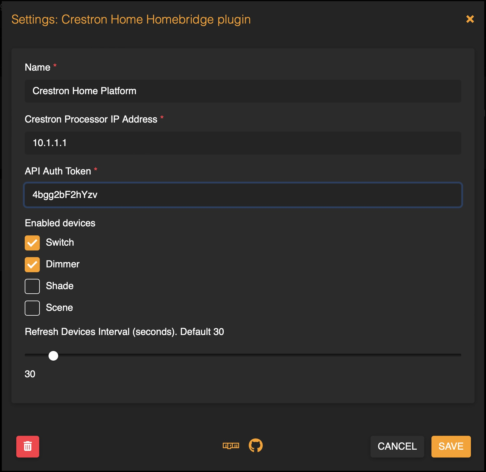

# Homebridge Crestron Home Plugin

This plugin connects to Crestron Home CWS server using REST API and doesn't require anything to be deployed into the Crestron controller. It was developed and tested with Crestron MC4-R powered by Crestron Home OS, but theoretically it should work with any Crestron controller that runs CWS server.

## Supported accessories
The following devices are currently supported:
* Lights and Dimmers
* Shades
* Lighting scenes exposed as LightBulb in the HomeKit
* Shade scenes exposed as Switch 
* genericIO scenes exposed as Locks

## Configuration
Two values are required for connecting Homebridge to Crestron controller:
1. Controller IP address (or hostname if DNS is configured)
2. Web API Authentication Token.
   Authentication Token can be found in the Crestron Home setup app. Go to settings and click on "System control options" in this screen:
   
   and then copy value of the Authentication token in this screen:
   
3. Enable accessories that will appear in the HomeKit:
   
4. loginInterval: (Optional) Set re-login interval in minutes (default 4). According to Crestron documentation, login session is valid for 10 minutes. We keep session TTL 9 minutes and refresh session token with given interval.
   

